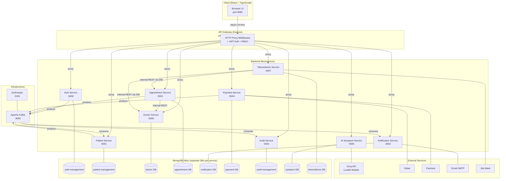

# Architecture Overview

**Project:** Smart Healthcare / Telemedicine Platform  
**Report Date:** April 17, 2026  
**Classification:** Academic Architecture Report

---

## 1. Executive Summary

This system is a **cloud-native, microservices-based telemedicine platform** built with Node.js (Express) on the backend and React (Vite + TypeScript) on the frontend. It enables patients to register, search for doctors, book appointments, pay for consultations, join video sessions, and receive notifications — all managed through a central API Gateway that enforces authentication and routes traffic to the appropriate downstream service.

Inter-service communication follows two patterns:

| Pattern | Usage |
|---------|-------|
| **Synchronous REST (HTTP proxy)** | Client → API Gateway → target service |
| **Asynchronous Event Streaming (Apache Kafka)** | Service-to-service domain events (registration, appointments, payments, audit) |

---

## 2. System Components

### 2.1 Frontend — `client/`

Built with **React 18 + TypeScript + Vite**. Styled with Tailwind CSS and shadcn/ui components. Communicates exclusively with the API Gateway over HTTP/REST.

Key pages:
- `LoginPage.tsx` / `PatientLogin.jsx` — authentication
- `Dashboard.jsx`, `PatientDashboard.jsx` — user home
- `Appointments.jsx` / `appointments/` — appointment booking & management
- `VideoConsultation.jsx` — Jitsi-based video room
- `payment/` — Stripe checkout integration
- `ai-service/` — AI symptom checker UI
- `doctor/` — doctor-specific dashboard

Client-side services (`client/src/services/`):
- `authAdminService.ts`, `patientService.ts`, `appointmentsService.ts`, `paymentService.ts`, `auditService.ts`, `aiService.ts`

---

### 2.2 API Gateway — `services/api-gateway/`

**Port:** 5400 (external)  
**Technology:** Express + `http-proxy-middleware`

The gateway is the **single entry point** for all client traffic. It:

1. Validates JWT tokens (stateless — no DB lookup)
2. Enforces role-based access control before forwarding
3. Injects trusted user-context headers (`x-user-id`, `x-user-role`, `x-user-email`, `x-user-name`, `x-api-key`, `x-gateway`) into forwarded requests
4. Proxies requests to the correct upstream service

**Route table:**

| Gateway Prefix | Target Service | Auth Required |
|---|---|---|
| `/api/auth` | auth-service:5000 | Public (register/login); Protected (me, admin) |
| `/api/patients` | patient-service:5001 | Required |
| `/api/reports` | patient-service:5001 | Required |
| `/api/audit` | audit-service:5002 | Required (ADMIN/DOCTOR) |
| `/api/notifications` | notification-service:3002 | Required |
| `/api/payments` | payment-service:5004 | Currently public (auth commented out) |
| `/api/appointments` | appointment-service:3001 | Public (search/slots); Required (booking) |
| `/api/doctors` | doctor-service:5006 | Required |
| `/api/doctor-auth` | doctor-service:5006 | Public (register/login) |
| `/api/symptoms` | ai-symptom-service:5005 | Public |
| `/api/telemedicine` | telemedicine-service:5007 | Required |

---

### 2.3 Microservices

#### Auth Service — `services/auth-service/`
**Port:** 5000 (internal only)  
**DB:** MongoDB `auth-management`  
Manages user registration, login, JWT issuance, and user account administration. Publishes `USER_REGISTERED`, `LOGIN_SUCCESS`, `LOGIN_FAILED` events to Kafka.

#### Patient Management Service — `services/patient-management-service/`
**Port:** 5001  
**DB:** MongoDB `patient-management`  
Manages patient profiles, medical history, prescriptions, and medical report uploads. Consumes `USER_REGISTERED` from Kafka to auto-create patient profiles. Publishes `PATIENT_REGISTERED`, `PATIENT_UPDATED`, `PATIENT_DEACTIVATED`, `REPORT_UPLOADED`, `PROFILE_UPDATED` events.

#### Doctor Service — `services/doctor-service/`
**Port:** 5006  
**DB:** MongoDB (doctor-specific)  
Manages doctor profiles, specializations, appointment slots, prescription creation, and admin approval workflow. Has its own JWT-based auth separate from the main auth-service for legacy reasons. Exposes an internal slot API consumed by the appointment-service.

#### Appointment Service — `services/appointment-service/`
**Port:** 3001  
**DB:** MongoDB `appointment-management`  
Core booking engine. Searches doctors, checks slot availability (via doctor-service internal API), reserves slots, stores appointments, manages status lifecycle (`pending` → `confirmed` → `completed`/`cancelled`), supports file upload for medical reports, and generates PDF receipts. Publishes `APPOINTMENT_BOOKED`, `APPOINTMENT_CANCELLED` events.

#### Notification Service — `services/notification-service/`
**Port:** 3002  
**DB:** MongoDB  
Sends email (Nodemailer/Gmail SMTP), SMS, and WhatsApp notifications. Exposes REST endpoints for direct notification triggers and maintains a persistent notification log. Listens to appointment-related events via Kafka to send automated notifications.

#### Payment Service — `services/payment-service/`
**Port:** 5004  
**DB:** MongoDB  
Integrates **Stripe** (card payments via checkout sessions) and **PayHere** (local Sri Lankan gateway). Handles webhook callbacks from both providers to update payment status. Publishes `PAYMENT_COMPLETED` events to Kafka.

#### Audit Management Service — `services/audit-management-service/`
**Port:** 5002 (internal only)  
**DB:** MongoDB `audit-management`  
Passive observer: subscribes to **all** Kafka topics and persists every domain event as an immutable audit log. Exposes read-only REST endpoints for admin/doctor review.

#### AI Symptom Service — `services/ai-symptom-service/`
**Port:** 5005  
**DB:** MongoDB (SymptomCheck collection)  
Integrates with the **Groq API** (LLaMA models) to analyse patient-submitted symptoms and return structured assessments (suggested condition, severity, recommendations, recommended doctor type).

#### Telemedicine Service — `services/telemedicine-service/`
**Port:** 5007  
**DB:** MongoDB (VideoSession collection)  
Manages **Jitsi Meet**-based video consultation sessions. Doctors create rooms linked to appointments; patients join via generated URLs. Validates appointment ownership before room creation.

---

## 3. Infrastructure

| Component | Technology | Port |
|---|---|---|
| Message broker | Apache Kafka (Confluent) | 9092 |
| ZooKeeper (Kafka coordinator) | ZooKeeper 3.x | 2181 |
| Database | MongoDB Atlas (cloud-hosted) | N/A |
| Container orchestration (dev) | Docker Compose | — |
| Container orchestration (prod) | Kubernetes (`k8s/`) | — |
| External AI | Groq API (LLaMA models) | HTTPS |
| Payment (cards) | Stripe | HTTPS |
| Payment (local) | PayHere | HTTPS |
| Email | Nodemailer → Gmail SMTP | 587 |

---

## 4. Architecture Diagram



---

## 5. Communication Patterns

### 5.1 Synchronous (HTTP REST via API Gateway)
All client requests travel through the API Gateway. The gateway proxy rewrites the path and injects auth headers before forwarding.

Service-to-service calls also occur synchronously:
- `appointment-service` → `doctor-service` (slot management, doctor lookup)
- `telemedicine-service` → `api-gateway` → `appointment-service`, `doctor-service`

### 5.2 Asynchronous (Apache Kafka)
Kafka is used for decoupled, event-driven communication:

| Producer | Topic | Consumers |
|---|---|---|
| auth-service | `user-registered`, `auth-events` | audit-service, patient-service |
| patient-service | `patient-events`, `patient-registered`, `patient-updated`, `patient-deactivated`, `report-uploaded` | audit-service |
| appointment-service | `appointment-events` | audit-service, notification-service |
| payment-service | `payment-events` | audit-service |

### 5.3 Internal API Key (Service Mesh)
All requests forwarded by the gateway carry an `x-api-key` header (value from `INTERNAL_API_KEY` env var). Downstream services validate this key to guarantee that requests originated from the gateway, not from a direct external caller.

---

## 6. Data Isolation

Each microservice owns its own MongoDB database. There is no shared database schema or cross-service DB joins. All cross-service data access goes through HTTP APIs or Kafka events, enforcing bounded context.

| Service | MongoDB Database |
|---|---|
| auth-service | `auth-management` |
| patient-service | `patient-management` |
| audit-service | `audit-management` |
| appointment-service | `appointment-management` (implicit) |
| doctor-service | doctor-specific DB |
| payment-service | payment DB |
| notification-service | notification DB |
| ai-symptom-service | symptom DB |
| telemedicine-service | telemedicine DB |

---

## Appendix — Source Code References

### `services/api-gateway/app.js` (Route registration)
```js
const express = require("express");
const cors = require("cors");

const authProxy = require("./routes/authProxy");
const patientProxy = require("./routes/patientProxy");
const auditProxy = require("./routes/auditProxy");
const notificationProxy = require("./routes/notificationProxy");
const paymentProxy = require("./routes/paymentProxy");
const appointmentProxy = require('./routes/appointmentProxy');
const doctorProxy = require('./routes/doctorProxy');
const aiSymptomProxy = require("./routes/aiSymptomProxy");
const doctorAuthProxy = require("./routes/doctorAuthProxy");
const telemedicineProxy = require("./routes/telemedicineProxy");

const app = express();

// ...cors, body-parser, logging...

app.use("/api/auth", authProxy);
app.use("/api/patients", patientProxy);
app.use("/api/reports", patientProxy);
app.use("/api/audit", auditProxy);
app.use("/api/notifications", notificationProxy);
app.use("/api/payments", paymentProxy);
app.use('/api/appointments', appointmentProxy);
app.use('/api/doctors', doctorProxy);
app.use("/api/doctor-auth", doctorAuthProxy);
app.use("/api/symptoms", aiSymptomProxy);
app.use("/api/telemedicine", telemedicineProxy);
```

### `services/api-gateway/config/services.js` (Service URL registry)
```js
module.exports = {
  AUTH_SERVICE_URL:         process.env.AUTH_SERVICE_URL || "http://localhost:5000",
  PATIENT_SERVICE_URL:      process.env.PATIENT_SERVICE_URL || "http://localhost:5001",
  AUDIT_SERVICE_URL:        process.env.AUDIT_SERVICE_URL || "http://localhost:5002",
  NOTIFICATION_SERVICE_URL: process.env.NOTIFICATION_SERVICE_URL || "http://localhost:3002",
  PAYMENT_SERVICE_URL:      process.env.PAYMENT_SERVICE_URL || "http://localhost:5004",
  APPOINTMENT_SERVICE_URL:  process.env.APPOINTMENT_SERVICE_URL || "http://localhost:3001",
  AI_SYMPTOM_SERVICE_URL:   process.env.AI_SYMPTOM_SERVICE_URL || "http://localhost:5005",
  DOCTOR_SERVICE_URL:       process.env.DOCTOR_SERVICE_URL || "http://localhost:5006",
  TELEMEDICINE_SERVICE_URL: process.env.TELEMEDICINE_SERVICE_URL || "http://localhost:5007",
  INTERNAL_API_KEY: process.env.INTERNAL_API_KEY || "gateway-secret-key-change-in-production",
};
```

### `services/shared/kafka/topics.js` (Kafka topic registry)
```js
const TOPICS = {
  PATIENT_EVENTS: 'patient-events',
  DOCTOR_EVENTS: 'doctor-events',
  APPOINTMENT_EVENTS: 'appointment-events',
  PAYMENT_EVENTS: 'payment-events',
  NOTIFICATION_EVENTS: 'notification-events',
  AUTH_EVENTS: 'auth-events',
  ADMIN_EVENTS: 'admin-events',
  USER_REGISTERED: 'user-registered',
  USER_DEACTIVATED: 'user-deactivated',
  PATIENT_REGISTERED: 'patient-registered',
  PATIENT_UPDATED: 'patient-updated',
  PATIENT_DEACTIVATED: 'patient-deactivated',
  REPORT_UPLOADED: 'report-uploaded',
  REPORT_DELETED: 'report-deleted',
};
module.exports = TOPICS;
```

### `docker-compose.yml` (Service topology excerpt)
```yaml
services:
  zookeeper:
    image: confluentinc/cp-zookeeper:7.4.0
    ports: ["2181:2181"]

  kafka:
    image: confluentinc/cp-kafka:7.4.0
    ports: ["9092:9092"]
    depends_on: [zookeeper]

  auth-service:       expose: ["5000"]
  patient-service:    ports: ["5001:5001"]
  audit-service:      expose: ["5002"]
  notification-service: expose: ["3003"]
  appointment-service: expose: ["3001"]
  payment-service:    expose: ["5004"]
  ai-symptom-service: expose: ["5005"]
  doctor-service:     expose: ["5006"]
  telemedicine-service: expose: ["5007"]
  client:             ports: ["8082:80"]
  api-gateway:        ports: ["5400:5400"]
```
