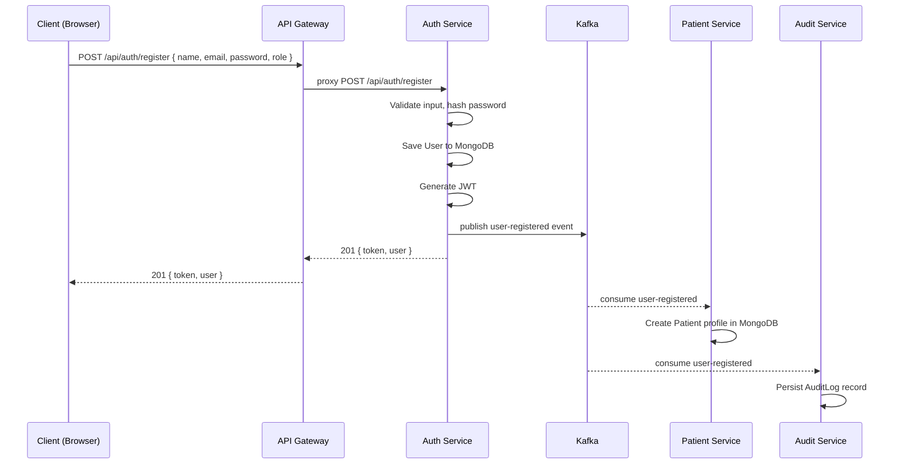
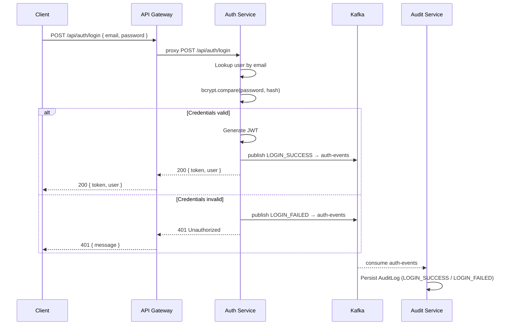
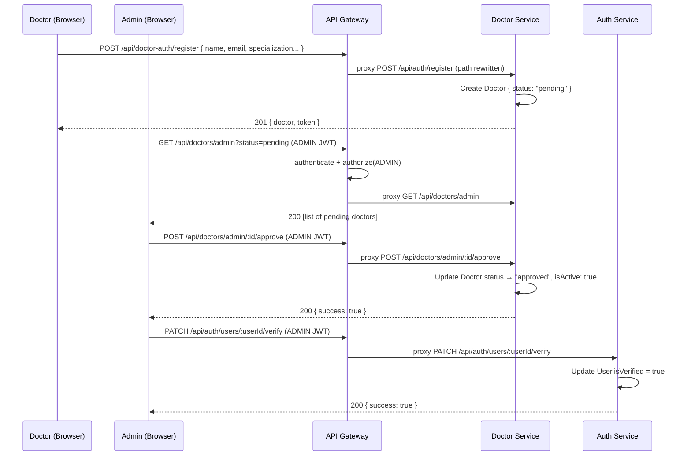
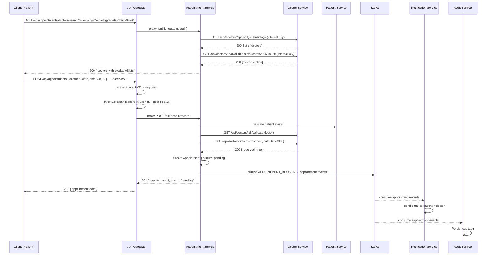
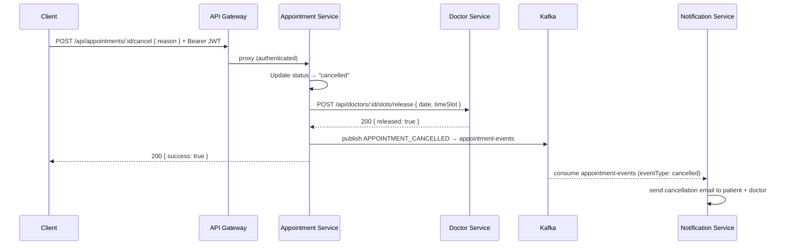
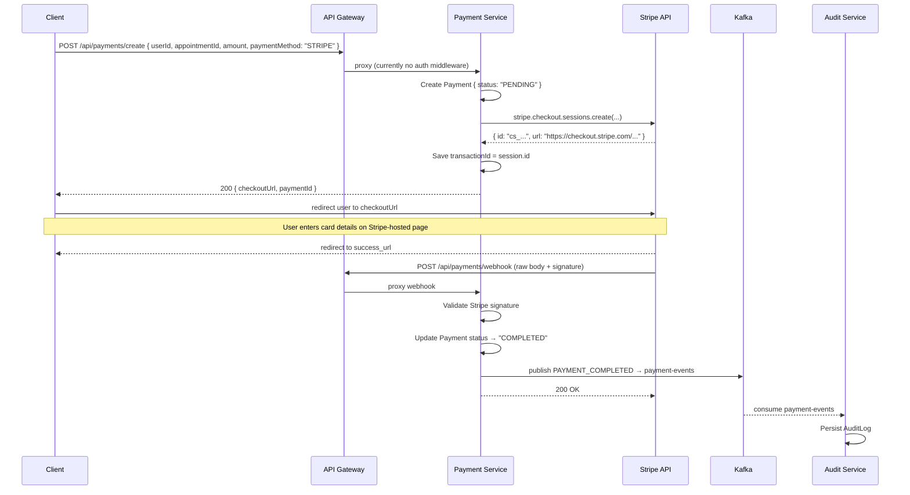
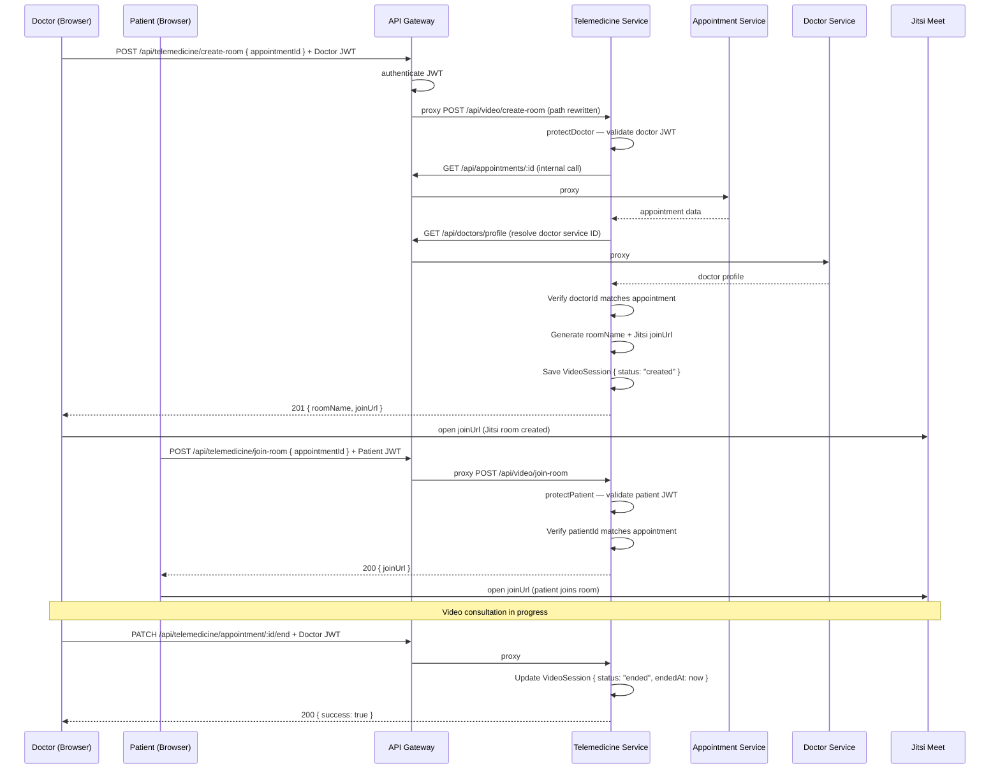
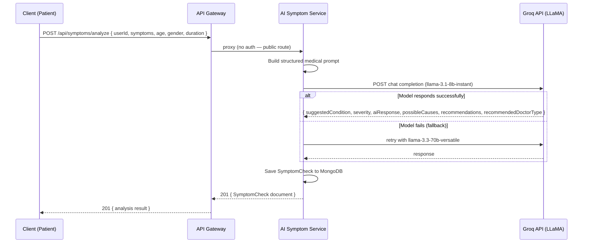
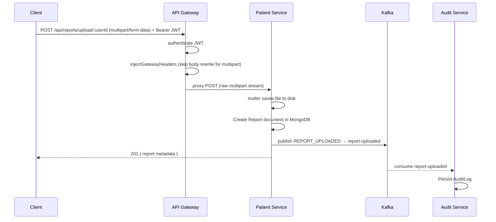
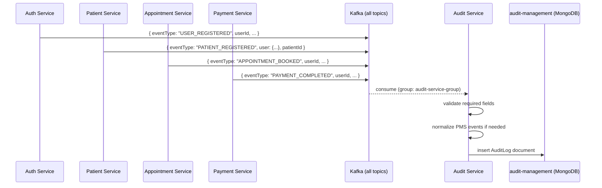

# Workflows

**Project:** Smart Healthcare / Telemedicine Platform  
**Report Date:** April 17, 2026

This document describes the key end-to-end workflows observed in the codebase, with step-by-step explanations and Mermaid sequence diagrams.

---

## Table of Contents
1. [User Registration](#1-user-registration)
2. [User Login](#2-user-login)
3. [Doctor Registration and Approval](#3-doctor-registration-and-approval)
4. [Appointment Booking](#4-appointment-booking)
5. [Appointment Cancellation](#5-appointment-cancellation)
6. [Payment Processing (Stripe)](#6-payment-processing-stripe)
7. [Video Consultation Session](#7-video-consultation-session)
8. [AI Symptom Analysis](#8-ai-symptom-analysis)
9. [Medical Report Upload](#9-medical-report-upload)
10. [Audit Log Capture](#10-audit-log-capture)

---

## 1. User Registration

**Services involved:** Client, API Gateway, Auth Service, Patient Management Service, Audit Service  
**Kafka topics:** `user-registered`

### Steps

1. User submits name, email, password, and role (`PATIENT`) via the registration form.
2. Client POSTs to `POST /api/auth/register` on the API Gateway (no auth required).
3. Gateway proxies request directly to the Auth Service.
4. Auth Service validates input, checks for duplicate email, hashes the password (bcrypt, 12 rounds), creates the `User` document in MongoDB `auth-management`.
5. Auth Service generates a JWT (7-day expiry) containing `{ id, role, email, name }`.
6. Auth Service publishes a `USER_REGISTERED` event to Kafka topic `user-registered`.
7. Auth Service returns `{ token, user }` to the client.
8. **Asynchronously:** Patient Management Service consumes `USER_REGISTERED` from Kafka and auto-creates a `Patient` profile document in MongoDB `patient-management`.
9. **Asynchronously:** Audit Service consumes `USER_REGISTERED` and persists an `AuditLog` record.
10. Client stores the JWT in local storage and redirects to the dashboard.



---

## 2. User Login

**Services involved:** Client, API Gateway, Auth Service, Audit Service  
**Kafka topics:** `auth-events`

### Steps

1. User submits email and password via the login form.
2. Client POSTs to `POST /api/auth/login`.
3. Gateway forwards to Auth Service (no auth middleware on this route).
4. Auth Service retrieves the User by email, compares the password hash using `bcrypt.compare`.
5. On success: generates a short-lived JWT (7d), publishes `LOGIN_SUCCESS` event to `auth-events` topic, returns `{ token, user }`.
6. On failure: publishes `LOGIN_FAILED` event, returns `401 Unauthorized`.
7. Client stores JWT; subsequent requests include it as `Authorization: Bearer <token>`.
8. Audit Service consumes `auth-events` and stores the login event.



---

## 3. Doctor Registration and Approval

**Services involved:** Client, API Gateway, Doctor Service, Auth Service (verify endpoint)

### Steps

1. A doctor submits their profile (name, email, password, specialization, clinic, fee) to `POST /api/doctor-auth/register`.
2. Gateway routes to Doctor Service auth (no authentication required; public endpoint).
3. Doctor Service creates a `Doctor` document with status `pending`.
4. Admin logs in and navigates to the admin panel.
5. Admin calls `GET /api/doctors/admin?status=pending` to view pending doctors.
6. Admin calls `POST /api/doctors/admin/:id/approve` to approve.
7. Doctor Service updates doctor status to `approved`, sets `isActive: true`.
8. Optionally, admin calls `PATCH /api/auth/users/:userId/verify` on the auth-service to mark the auth-layer user as verified.



---

## 4. Appointment Booking

**Services involved:** Client, API Gateway, Appointment Service, Doctor Service, Patient Service, Notification Service, Audit Service  
**Kafka topics:** `appointment-events`

### Steps

1. Patient searches for a doctor: `GET /api/appointments/doctors/search?specialty=...&date=...`
2. Appointment Service queries Doctor Service's internal slot API for available doctors and their slots.
3. Patient selects a doctor and time slot; optionally uploads a report file.
4. Client POSTs `POST /api/appointments` (with JWT).
5. Gateway authenticates JWT, injects headers, forwards to Appointment Service.
6. Appointment Service:
   a. Validates patient exists (calls Patient Service via internal API or gateway headers)
   b. Validates doctor exists and slot is available (calls Doctor Service internal slot API)
   c. **Reserves the slot** via `POST /api/auth/doctors/:id/slots/reserve` (to doctor-service)
   d. Creates `Appointment` document in MongoDB with status `pending`
7. Appointment Service publishes `APPOINTMENT_BOOKED` to Kafka `appointment-events`.
8. Response `201` with appointment details returned to client.
9. **Asynchronously:** Notification Service consumes `appointment-events` and sends confirmation email/SMS to patient and doctor.
10. **Asynchronously:** Audit Service persists the appointment booking event.



---

## 5. Appointment Cancellation

**Services involved:** Client, API Gateway, Appointment Service, Doctor Service, Notification Service

### Steps

1. Patient or doctor calls `POST /api/appointments/:id/cancel` with JWT.
2. Gateway authenticates and forwards to Appointment Service.
3. Appointment Service updates status to `cancelled`, records cancellation reason.
4. Appointment Service calls Doctor Service to **release** the reserved slot.
5. Appointment Service publishes `APPOINTMENT_CANCELLED` to Kafka.
6. Notification Service sends cancellation confirmation emails to both parties.



---

## 6. Payment Processing (Stripe)

**Services involved:** Client, API Gateway, Payment Service, Stripe (external), Audit Service  
**Kafka topics:** `payment-events`

### Steps

1. After booking, client initiates payment via `POST /api/payments/create`.
2. Payment Service creates a `Payment` document with status `PENDING`.
3. Payment Service calls **Stripe API** to create a checkout session.
4. Stripe returns a `checkoutUrl` for the hosted payment page.
5. Payment Service saves the Stripe session ID as `transactionId` and returns the `checkoutUrl` to client.
6. Client redirects user to Stripe's hosted checkout page.
7. User completes payment on Stripe; Stripe POSTs a webhook event to `POST /api/payments/webhook`.
8. Payment Service validates the webhook signature and updates Payment status to `COMPLETED`.
9. Payment Service publishes `PAYMENT_COMPLETED` to Kafka `payment-events`.
10. Client polls or receives redirect to `/.../appointments?payment=success`.



---

## 7. Video Consultation Session

**Services involved:** Client, API Gateway, Telemedicine Service, Appointment Service, Doctor Service  
**External:** Jitsi Meet

### Steps

1. Doctor navigates to an `confirmed` appointment and clicks "Start Video Consultation".
2. Client calls `POST /api/telemedicine/create-room` (Doctor JWT required).
3. Gateway authenticates, injects headers, rewrites path (`/api/telemedicine/*` → `/api/video/*`), forwards to Telemedicine Service.
4. Telemedicine Service's `protectDoctor` middleware extracts doctor JWT.
5. Service calls Gateway → Appointment Service to validate the appointment exists and belongs to this doctor.
6. Service generates a unique `roomName` and a Jitsi `joinUrl`.
7. Saves `VideoSession` document to MongoDB.
8. Returns `{ joinUrl, roomName, status: "created" }` to doctor.
9. Doctor shares/opens the join URL, Jitsi session becomes `active`.
10. Patient calls `POST /api/telemedicine/join-room` (Patient JWT required).
11. Telemedicine Service validates patient is the appointment's patient.
12. Returns the same `joinUrl` to the patient.
13. Both parties join the Jitsi room.
14. Doctor calls `PATCH /api/telemedicine/appointment/:id/end` when done.
15. Telemedicine Service updates `VideoSession.status = "ended"`, records `endedAt`.



---

## 8. AI Symptom Analysis

**Services involved:** Client, API Gateway, AI Symptom Service, Groq API (external)

### Steps

1. Patient navigates to the AI Symptom Checker page.
2. Patient enters symptoms, age, gender, duration, notes.
3. Client POSTs to `POST /api/symptoms/analyze` (currently public — no auth required at gateway).
4. Gateway forwards to AI Symptom Service.
5. AI Symptom Service constructs a prompt and calls **Groq API** with a LLaMA model (tries multiple models with fallback: `llama-3.1-8b-instant` → `llama-3.3-70b-versatile` → `meta-llama/llama-4-scout-17b-16e-instruct`).
6. Groq returns a structured JSON response (condition, severity, causes, recommendations, doctor type).
7. AI Service persists a `SymptomCheck` document in MongoDB.
8. Response returned to client with full analysis result.



---

## 9. Medical Report Upload

**Services involved:** Client, API Gateway, Patient Management Service, Audit Service  
**Kafka topics:** `report-uploaded`

### Steps

1. Patient (or doctor/admin) selects a file to upload.
2. Client POSTs to `POST /api/reports/upload/:userId` as `multipart/form-data`, field name `report`.
3. Gateway passes multipart stream un-modified (body rewriter is skipped for `multipart/form-data`).
4. Patient Management Service's multer middleware stores the file on disk.
5. A `Report` document is created in MongoDB with file metadata (path, original name, MIME type, size, type classification).
6. Patient Management Service publishes `REPORT_UPLOADED` event to Kafka `report-uploaded` topic.
7. Audit Service consumes the event and stores an audit log.



---

## 10. Audit Log Capture

**Services involved:** All services (producers), Audit Service (consumer)  
**Kafka topics:** All topics listed in `shared/kafka/topics.js`

### Overview

The Audit Service is a **passive observer**. It subscribes to every Kafka topic in `topics.js` and persists each event as an immutable `AuditLog` document. No service explicitly calls the audit service via REST to log events.

### Topics consumed by Audit Service

| Topic | Source Services |
|---|---|
| `auth-events` | auth-service |
| `user-registered` | auth-service |
| `user-deactivated` | auth-service |
| `patient-events` | patient-service |
| `patient-registered` | patient-service |
| `patient-updated` | patient-service |
| `patient-deactivated` | patient-service |
| `report-uploaded` | patient-service |
| `report-deleted` | patient-service |
| `doctor-events` | doctor-service |
| `appointment-events` | appointment-service |
| `payment-events` | payment-service |
| `notification-events` | notification-service |
| `admin-events` | admin operations |

### Event normalization

PMS-native events (`patient-registered`, `patient-updated`, `patient-deactivated`) use a different payload format and are normalized by the audit consumer before processing.



---

## Appendix — Source Code References

### `services/appointment-service/src/services/appointmentService.js` (booking logic excerpt)
```js
async bookAppointment(appointmentData) {
  const patient = await externalServices.getPatientDetails(appointmentData.patientId);
  const doctor = await externalServices.getDoctorDetails(appointmentData.doctorId);

  const isAvailable = await externalServices.checkAvailability(
    appointmentData.doctorId, appointmentData.date, appointmentData.timeSlot
  );
  if (!isAvailable) throw new Error('Selected time slot is not available');

  const reserved = await externalServices.reserveDoctorSlot(
    appointmentData.doctorId, appointmentData.date, appointmentData.timeSlot
  );
  if (!reserved) throw new Error('Failed to reserve selected time slot');

  // Create appointment document...
  await kafka.publish(TOPICS.APPOINTMENT_EVENTS, appointmentBookedEvent);
}
```

### `services/auth-service/controllers/authController.js` (registration event)
```js
async register(req, res) {
  const result = await authService.register(req.body);
  const event = createEvent({
    eventType: EVENTS.USER_REGISTERED,
    userId: result.user.id,
    ...
  });
  publishEvent(TOPICS.USER_REGISTERED, event).catch(...);
  return res.status(201).json({ success: true, data: result });
}
```

### `services/payment-service/src/controllers/paymentController.js` (Stripe flow)
```js
exports.createPayment = async (req, res) => {
  const payment = new Payment({ userId, appointmentId, amount, status: "PENDING" });
  await payment.save();

  const session = await stripe.checkout.sessions.create({
    payment_method_types: ["card"],
    mode: "payment",
    line_items: [{ price_data: { currency: "lkr", unit_amount: amount * 100 }, quantity: 1 }],
    metadata: { paymentId: payment._id.toString() },
    success_url: `${CLIENT_URL}/appointments?payment=success`,
    cancel_url: `${CLIENT_URL}/appointments?payment=cancel`,
  });
  payment.transactionId = session.id;
  await payment.save();
  res.status(200).json({ checkoutUrl: session.url, paymentId: payment._id });
};
```

### `services/telemedicine-service/src/controllers/videoController.js` (create room)
```js
const createVideoRoom = async (req, res) => {
  const appointment = await fetchAppointmentById(appointmentId, req);
  const doctorServiceId = await fetchDoctorServiceId(req);
  if (String(appointment.doctorId) !== String(doctorServiceId))
    return res.status(403).json({ message: "Not allowed" });

  const roomName = `appt-${appointmentId}-${uuidv4()}`;
  const joinUrl = `https://meet.jit.si/${roomName}`;
  await VideoSession.create({ appointmentId, doctorId, patientId, roomName, joinUrl, status: "created" });
  res.status(201).json({ roomName, joinUrl });
};
```

### `services/audit-management-service/kafka/consumer.js` (multi-topic subscription)
```js
const TOPIC_LIST = Object.values(TOPICS); // subscribe to ALL topics

const normalizePmsMessage = (raw, topic) => ({
  eventType: eventTypeMap[topic],
  userId: raw.user?.id,
  serviceName: 'patient-service',
  ...
});

// consumer.run({ eachMessage: async ({ topic, message }) => {
//   const parsed = JSON.parse(message.value.toString());
//   const normalized = PMS_RAW_TOPICS.has(topic) ? normalizePmsMessage(parsed, topic) : parsed;
//   validateMessage(normalized);
//   await AuditLog.create(normalized);
// }});
```

### `services/ai-symptom-service/src/services/aiService.js` (model fallback)
```js
const MODELS = [
  "llama-3.1-8b-instant",
  "llama-3.3-70b-versatile",
  "meta-llama/llama-4-scout-17b-16e-instruct",
];
// Iterates models in order, falls back on failure
for (const model of MODELS) {
  try {
    const completion = await groq.chat.completions.create({ model, messages: [...] });
    return JSON.parse(completion.choices[0].message.content);
  } catch (err) { lastError = err; }
}
throw lastError;
```
